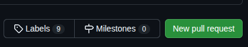

# Sistema-Robotico-Colabortivo
Desarrollo Puzzle Bot con ROS2 y LIDAR

# Instrucciones:
1. Clonar el repositorio (1 vez)

2. Para trabajo individual seleccionar la **rama** "tasks" usando el comando: `git checkout tasks`

3. Crear una rama **subyacente de tasks** usando el coamndo: `git checkout -b <nombre-rama-nueva>`

4. Realizar las modificaciones.

5. Agregar cambios: `git add -A` y hacer commit con: `git commit -m "mensaje commit"` 
> [!NOTE]
> Es recomendable que cada cambio importante hacer un commit 

6. Hacer un pull al repositorio remoto con: `git pull origin tasks`
> [!NOTE]
> En caso de haber conflictos resolverlos **localmente** y luego hacer un add y luego un commit

7. Una vez terminadas las modificaciones, hacer `git push origin <nombre-rama-nueva>` o `git push --set-upstream origin <nombre-rama-nueva>` 

8. Ir a GitHub a hacer un Pull Request (PR)

9. Crear un nuevo Pull Request (PR)

10. 

# Integrantes:
1. Jose
2. Israel
3. Paulina
4. Ricard 
