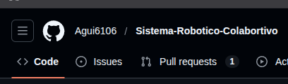
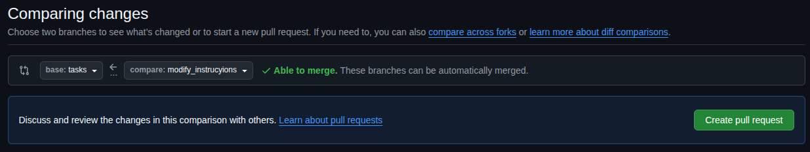
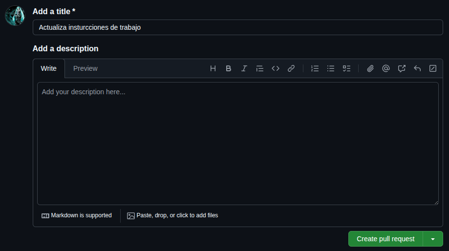
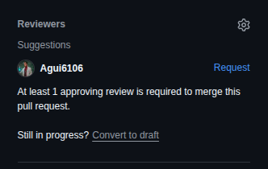
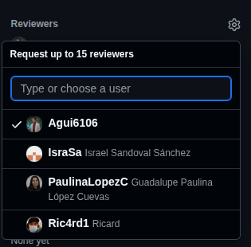
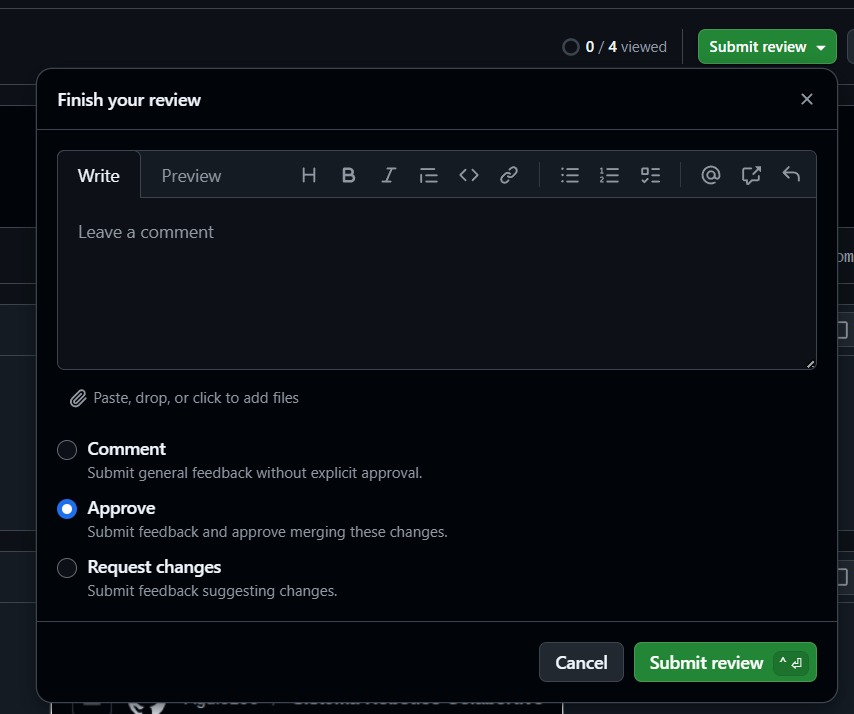

# Sistema-Robotico-Colabortivo
Desarrollo Puzzle Bot con ROS2 y LIDAR

# Instrucciones:
1. Clonar el repositorio (1 vez). **EN CASO DE YA ESTAR CLONADO:** Realizar un `git pull` para actualizar el repositorio local
> [!NOTE]
> En caso de que en local aparezcan ramas antiguas que fueron borradas en en el repositorio web ejecutar: `git fetch --prune` 

2. Para trabajo individual seleccionar la **rama** "tasks" usando el comando: `git checkout tasks`

3. Crear una rama **subyacente de tasks** usando el coamndo: `git checkout -b <nombre-rama-nueva>`

4. Realizar las modificaciones.

5. Agregar cambios: `git add -A` y hacer commit con: `git commit -m "mensaje commit"` 
> [!NOTE]
> Cada cambio importante hacer un commit 

6. Hacer un pull al repositorio remoto con: `git pull origin tasks`
> [!NOTE]
> En caso de haber conflictos resolverlos **localmente** y luego hacer un add y luego un commit

7. Una vez terminadas las modificaciones, hacer `git push origin <nombre-rama-nueva>` o `git push --set-upstream origin <nombre-rama-nueva>` 

8. Ir a GitHub a hacer un Pull Request (PR)

9. Crear un nuevo Pull Request (PR)

10. Seleccionar las ramas en los menus desplegables y dar click en **Create pull request**.

11. Poner un titulo descriptivo de lo que se modifico y dar click en **Create pull request**.

12. Asignar a una o mas personas solicitud de aprobacion. 

> [!TIP]
> En caso de no encontrar ninguna sugerencia dar click en rueda de configuracion y seleccionar un miembro

**Para el que verifique:**
1. Aceptar el pull request: 

2. Revisar que **NO** se esten mezclando las ramas **main** ni **develop** con **tasks**

3. Si no hay conflictos aceptar el pull request con el boton **Submit review**
 

> [!NOTE]
> En caso de encontrar conflictos o incopatibilidades, seleccionar **Request Changes** y volver a modificar

4. Realizar el merge en GitHub y eliminar la rama.

# Integrantes:
1. Jose
2. Israel
3. Paulina
4. Ricard 
